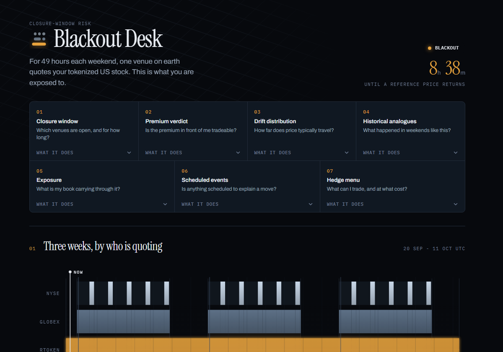
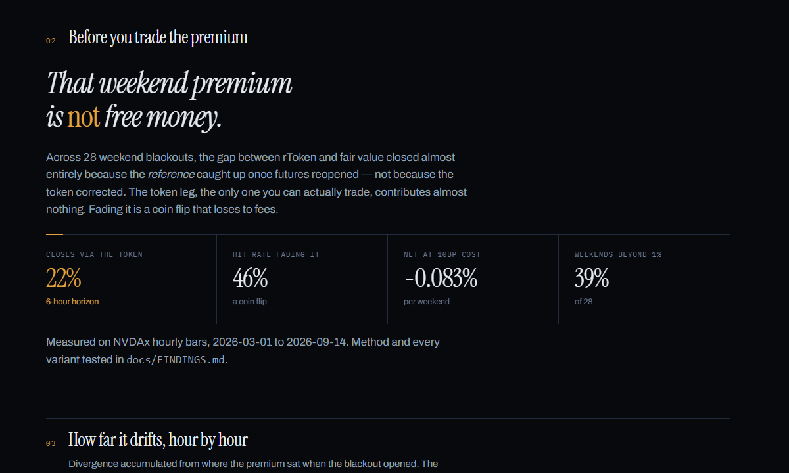
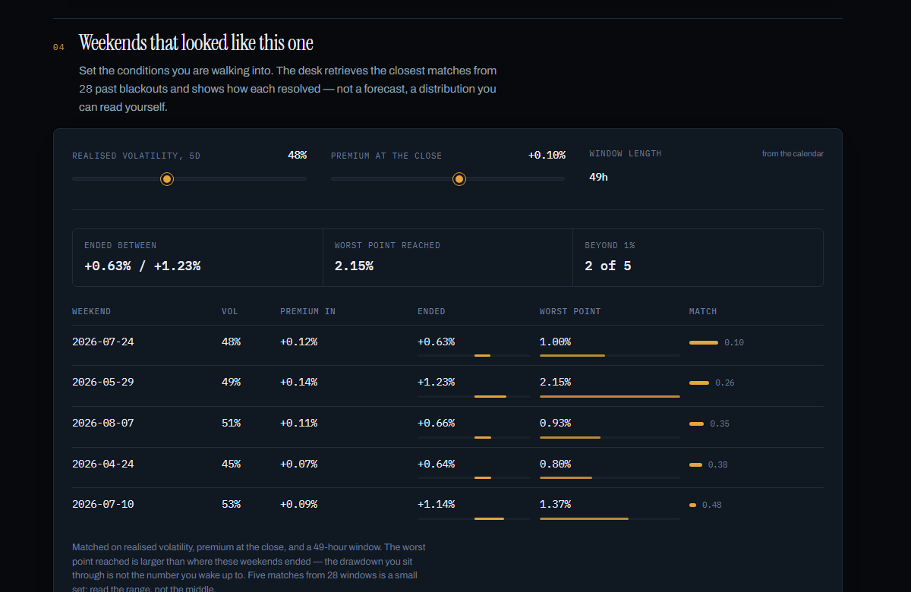

# Blackout Desk

**A closure-window risk desk for traders holding tokenized US stocks.**

[](https://blackout-desk-eight.vercel.app)
[](tests/)
[](LICENSE)

**Bitget AI Base Camp Hackathon S2** — 🟧 AI Trading Desk · Decision Stress Testing

It is Friday 15:45 in New York. In fifteen minutes NYSE closes; in seventy-five,
CME Globex follows. For the next **49 hours** one venue on earth quotes your
position, you cannot watch it, and no arbitrageur stands behind the price.
Blackout Desk tells you what you are exposed to before that window opens.

**→ [blackout-desk-eight.vercel.app](https://blackout-desk-eight.vercel.app)** —
no account, no sign-in, no sharing step.



## The finding the product is built on

Its central claim is counterintuitive, and it was measured rather than assumed:
the weekend premium on rToken is **not an arbitrage opportunity**. Across 197
days of hourly data, 78–98% of the gap closes because the stale *reference*
catches up, not because the token corrects. Trading against it is a 46% coin
flip that dies at 10bp costs, measured over 28 weekend blackouts.

This falsified the strategy the project started as. The decisive test — splitting
premium closure into the leg you can trade and the leg you cannot — is in
[`docs/FINDINGS.md`](docs/FINDINGS.md), along with every variant tested and the
cross-venue replication on Bitget's own book.



**A tool that prevents a losing trade is worth more than one that invents a
winning one**, and this one can prove the trade is bad.

## The seven tools

Each answers one research question, and the page runs them in the order a trader
reasons through them.

| # | Tool | Question |
|---|---|---|
| 1 | `closure_window` | Which venues are open, and for how long? |
| 2 | `premium_verdict` | Is the premium in front of me tradeable? |
| 3 | `divergence_distribution` | How far does price typically drift by hour *H*? |
| 4 | `historical_analogues` | Which past weekends looked like this one? |
| 5 | `exposure` | What is my book carrying through the window? |
| 6 | `macro_calendar` | Is anything scheduled to explain a move? |
| 7 | `hedge_menu` | What still trades, and does it actually help? |



## Run the whole thing in one command

```bash
pip install -e ".[dev]"
python scripts/research_task.py     # all 7 tools, question to actionable insight
```

That is the required research-task deliverable, regenerated end to end — its
output is committed as [`docs/RESEARCH_TASK.md`](docs/RESEARCH_TASK.md) so the
figures in it cannot go stale.

## What is built, what is not

**Built and verified.** All seven tools, behind one contract (`src/blackout/tools.py`),
each pinned against the shipped payload. The research pipeline, reproducible from
raw data. Both deployments from one template. The language layer in the artifact
build. 199 tests, hermetic — they pass with every socket blocked.

**Partial.** The event calendar covers FOMC only, and deliberately: anything added
has to come from its issuing authority, because the product's argument is that its
numbers are checkable. Cross-venue replication holds at +1h on both venues but
cannot pin the longer horizons — 13 overlapping weekends is not enough, and
[`docs/FINDINGS.md`](docs/FINDINGS.md) says so rather than quoting the number.

**Not shipped.** No user testing yet, so every product metric in the submission is
labelled *targeted* rather than *observed*. No Bitget Agent Hub / Skills
integration. No screen recording of the conversational flow.

## Known limitations

- **28 weekends is a thin sample.** It is what 197 days of rToken history allows.
  It is stated next to every distribution rather than hidden.
- **Hourly resolution.** Sub-hourly microstructure could behave differently and
  there is no data here to say.
- **The +6h decomposition is sample-sensitive** — it moves 22% → 54% on the same
  venue purely by shortening the window. The direction is robust; the decimal is
  a property of the sample.
- **The artifact needs republishing by hand** after a data refresh. Vercel
  redeploys on push; nothing republishes the artifact.

## Bugs this project found in itself

Kept because they are the useful part of the record, and each one now has a test.

| Bug | Why nothing caught it |
|---|---|
| A bare `NaN` in the payload rendered the page **entirely blank** | `JSON.parse` rejects it and throws before anything draws |
| A stripped backslash broke a JS string literal | HTML validated, every element present, whole suite green, page dead |
| A CSS escape became `U+0091` + a literal `2` | The character has no width in an editor; the stylesheet still parsed |
| The LLM prompt said "27 weekend blackouts" while the data said 28 | The figure appears nowhere on screen; the model just repeats it |
| The page scrolled sideways at every width | The decorative lattice is inset −30% and nothing clipped it |
| The exposure heading read `$250,00` | A fixed-width input clipped its own default value |

## Layout

```
src/blackout/     the analytics engine, and the 7-tool contract over it
tests/            199 tests, including jsdom render and JS/Python parity checks
scripts/          research, ingestion, build and image generation
web/              page template; desk.html is GENERATED, never hand-edited
public/           the Vercel build, the mark, the share card
data/raw/         10 committed hourly series - how the data travels between machines
docs/             architecture, findings, submission, and the visual spec
```

## Documentation

| Doc | What it covers |
|---|---|
| [`docs/ARCHITECTURE.md`](docs/ARCHITECTURE.md) | System design, the tool contract, what shipped against the plan |
| [`docs/FINDINGS.md`](docs/FINDINGS.md) | The research result, every variant tested, the cross-venue check |
| [`docs/SUBMISSION.md`](docs/SUBMISSION.md) | The six-part project description, ready for the form |
| [`docs/RESEARCH_TASK.md`](docs/RESEARCH_TASK.md) | The required end-to-end research task (generated) |
| [`docs/FRONTEND.md`](docs/FRONTEND.md) | Visual architecture: palette, type scale, the living-state mechanic |
| [`docs/DEPLOY.md`](docs/DEPLOY.md) | The two deployments and why they differ |
| [`docs/S2_BRIEF.md`](docs/S2_BRIEF.md) | Competition rules, tracks, submission requirements |

## Commands

```bash
python -m pytest -q                     # 199 tests
python scripts/analyse_basis.py         # reproduce the research finding
python scripts/cross_venue.py           # re-run it on Bitget's own book
python -m blackout.tools                # list the seven tools; add a name to run one
python scripts/blackout_stats.py        # closure-window calendar structure
python scripts/figures.py               # canonical figures, stable and diffable
python scripts/build_page.py            # payload + template -> both builds
python scripts/make_images.py           # the mark -> share card, icon, screenshots
```

Refreshing data (needs open network — market data hosts are blocked in the
Claude Code web sandbox):

```bash
python scripts/probe_sources.py         # rToken hourly, rate-limited, resumable
python scripts/fetch_reference.py       # native equity, futures, crypto proxies
python scripts/fetch_events.py          # FOMC decisions from federalreserve.gov
python scripts/fetch_bitget.py          # rToken candles from Bitget spot
```

## Licence

[MIT](LICENSE).

---

**Deadline: 21 September 2026 (UTC+8).**
